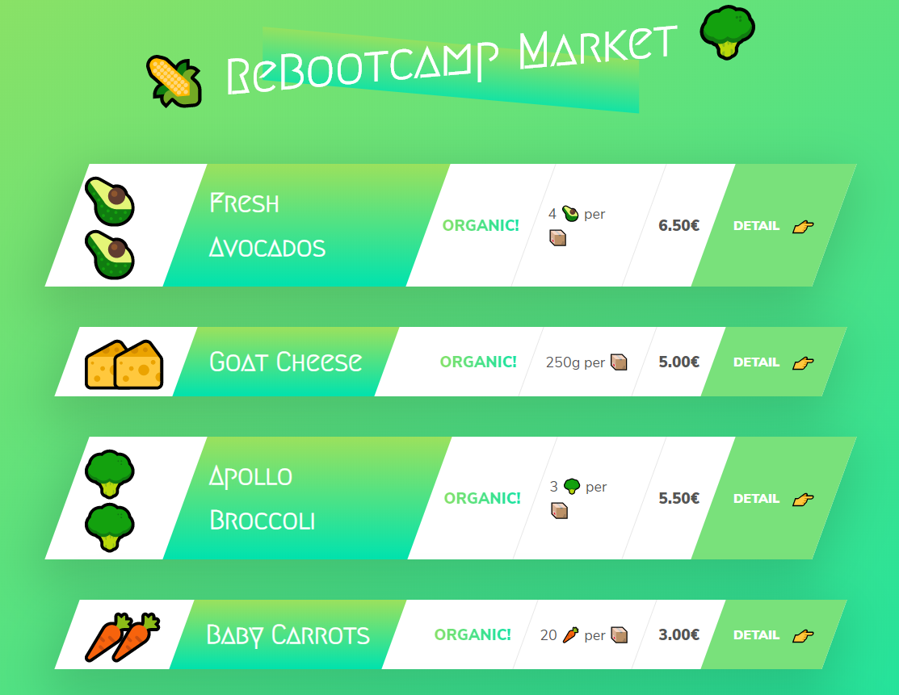

# SHOP
- [Link to site](https://supermarket-refactoring.azurewebsites.net/)

- Integration: [](https://dev.azure.com/alexismateo-org/super-market/_build/latest?definitionId=4&branchName=master)

- Deployment: [](https://vsrm.dev.azure.com/alexismateo-org/_apis/public/Release/badge/84431c95-62a6-4d2a-9672-7432ffaf6b82/1/1)
<br/>

## Quality Gates
- [](http://sonarqubecaribe.eastus2.cloudapp.azure.com/dashboard?id=SuperMarket)
- [](http://sonarqubecaribe.eastus2.cloudapp.azure.com/dashboard?id=SuperMarket)
- [](http://sonarqubecaribe.eastus2.cloudapp.azure.com/dashboard?id=SuperMarket)
- [](http://sonarqubecaribe.eastus2.cloudapp.azure.com/dashboard?id=SuperMarket)
- [](http://sonarqubecaribe.eastus2.cloudapp.azure.com/dashboard?id=SuperMarket)


## Azure devops account 
  - create an azure devops account [here](https://azure.microsoft.com/en-us/services/devops/)
  - create an organization in azure devops. [guide](https://docs.microsoft.com/en-us/azure/devops/organizations/accounts/create-organization?view=azure-devops).
  - create a project in your organization. [guide](https://docs.microsoft.com/en-us/azure/devops/organizations/projects/create-project?toc=%2fazure%2fdevops%2fuser-guide%2ftoc.json&%3bbc=%2fazure%2fdevops%2fuser-guide%2fbreadcrumb%2ftoc.json&view=azure-devops)
  - import this repository to your project. [how to import](https://docs.microsoft.com/en-us/azure/devops/repos/git/import-git-repository?view=azure-devops)
  - Full Guide [here](https://docs.microsoft.com/en-us/azure/devops/user-guide/?view=azure-devops)

## SonarQube
  - you can use sonarcloud 14 days free trial. [sonarcloud](https://sonarcloud.io/about).
  - setup sonarcloud in azure devops. [link](https://sonarcloud.io/documentation/integrations/vsts/)

## Features/highlights

- a sample e-commerce shopping site using azure devops pipelines

## Local setup
```bash
$ git clone https://github.com/Refactoring-do/azure-devops-pipelines.git
$ cd azure-devops-pipelines/
$ npm i
$ npm start
```

## run in dev mode
To test:
```bash
$ npm run dev
```
## run the tests
To test:
```bash
$ npm run test
```
